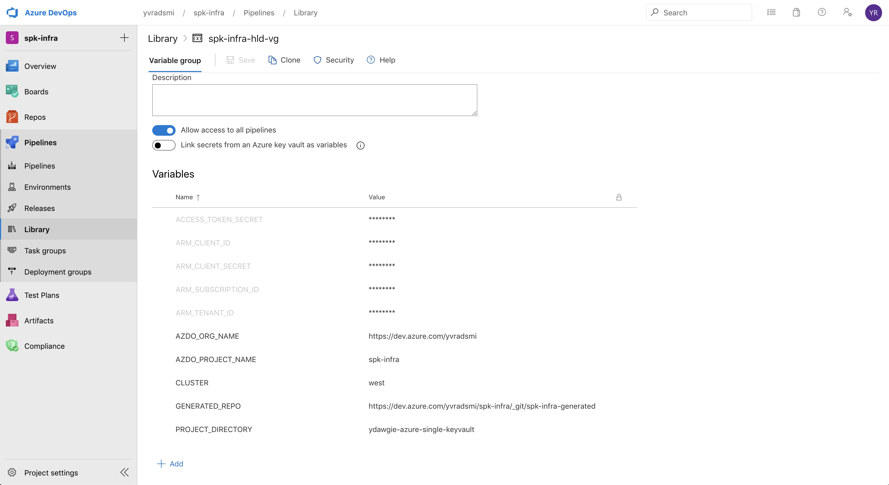
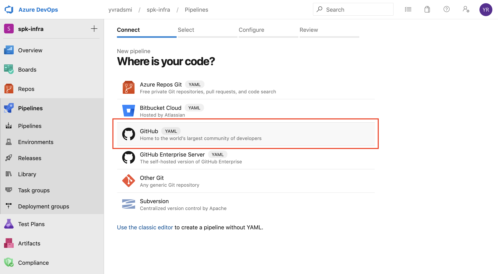
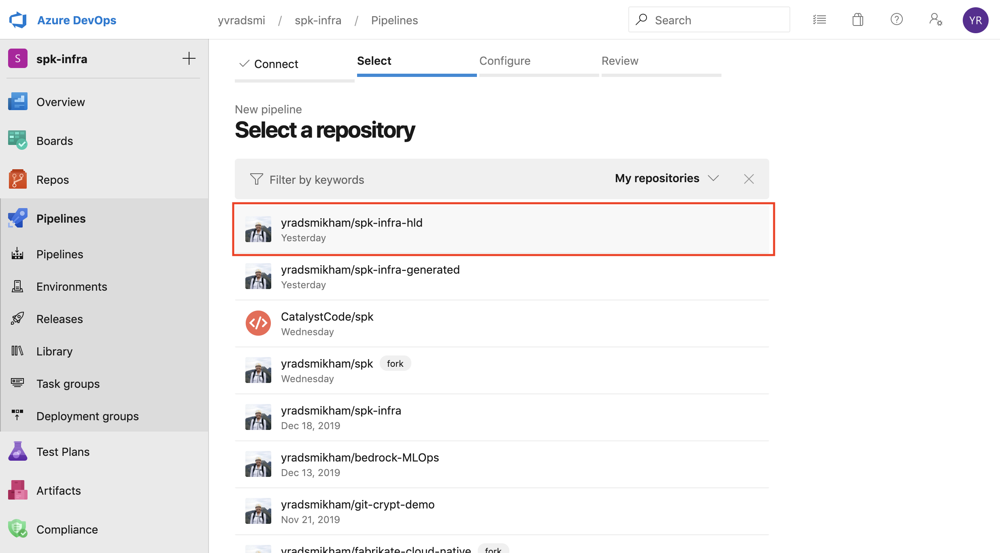
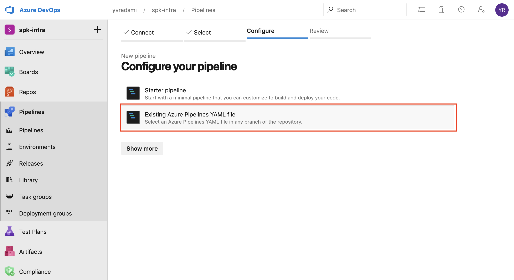
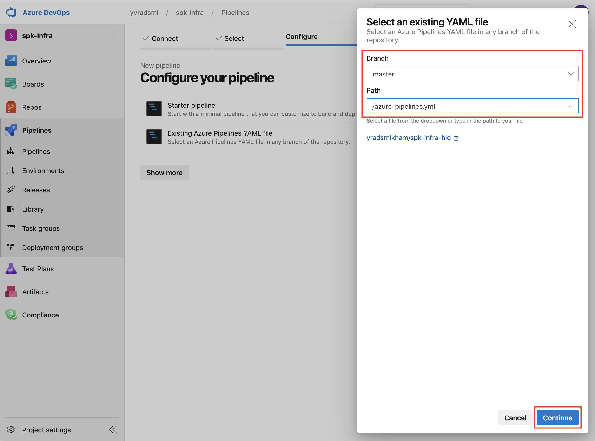
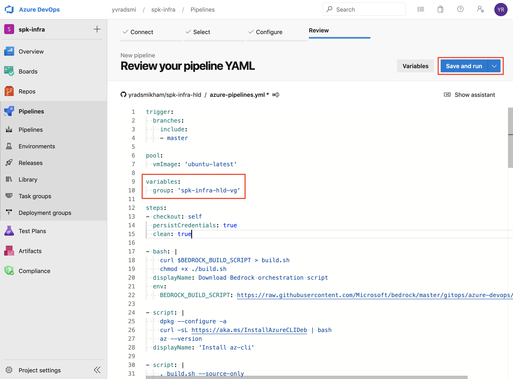

# Guide: Infrastructure Generation Pipeline

This section describes how to configure Azure Devops to be your CI/CD
orchestrator for your Infrastructure Generation workflow using `spk infra`.

## Prerequisites

1. _Permissions_: The ability to create Projects in your Azure DevOps
   Organization.
2. _High Level Definitions_: Your own infrastructure high level definitions for
   your deployment. You can refer to a sample repo
   [here](https://github.com/yradsmikham/spk-infra-hld).

## Setup

### 1. Create Repositories and Personal Access Tokens (PATs)

Create both an infrastructure high level definition (HLD) and infrastructure
generated repos. You will also need to create personal access tokens that you
can use for the Infra CI/CD pipeline. We have instructions for how to do that in
two flavors:

- [Azure DevOps](https://github.com/microsoft/bedrock/blob/master/gitops/azure-devops/ADORepos.md)
- [GitHub](https://github.com/microsoft/bedrock/blob/master/gitops/azure-devops/GitHubRepos.md)

### 2. Add Azure Pipeline Build YAML

The SPK repository has an `azure-pipelines.yml`
[template](../../infra-generation-pipeline.yml) that you may use as reference.
Add the `infra-generation-pipeline.yml` file to the root of the Infra HLD repo.

### 3. Create Pipeline

We use
[Azure Pipelines](https://docs.microsoft.com/en-us/azure/devops/pipelines/get-started/key-pipelines-concepts?toc=/azure/devops/pipelines/toc.json&bc=/azure/devops/boards/pipelines/breadcrumb/toc.json&view=azure-devops)
to generate Terraform files based on your infrastructure high level description
yaml files (e.g. definition.yaml).

In Azure DevOps:

1. Create a Variable Group.

Variable Groups may vary based on the `azure-pipelines.yml` used, but for the
spk `infra-generation-pipeline.yml` template, the following variables will need
to be added as part of the pipeline Variable Group:

```
ACCESS_TOKEN_SECRET: Personal Access Token for your repo type.
ARM_CLIENT_ID: Azure Service Principal App ID
ARM_CLIENT_SECRET: Azure Service Principal password
ARM_SUBSCRIPTION_ID: Azure Subscription ID
ARM_TENANT_ID: Azure Service Principal Tenant ID
CLUSTER: A specific cluster name of a multi-cluster (i.e. west)
GENERATED_REPO: The full URL to your manifest repo (i.e. https://github.com/yradsmikham/spk-infra-generated.git)
PROJECT_DIRECTORY: The name of your project (i.e. discovery-service)
```

If using Azure DevOps repos, be sure to include the additional environment
variables:

```
AZDO_ORG_NAME: Azure DevOps organizational url (i.e. https://dev.azure.com/org_name/)
AZDO_PROJECT_NAME: The name of the project in your Azure DevOps organization where the repository is hosted
```



2. Create a new pipeline.


3. Choose the platform you are using for source control. For now, there are only
   examples for GitHub and Azure DevOps repos. However, other version control
   tools should be fairly similar.



4. Select an Infra HLD repository.



5. Choose "Existing Azure Pipeline YAML file" if there is an
   `azure-pipelines.yml` in the selected Infra HLD repo.



6. On the side panel, select the appropriate repo branch to work from, and also
   the path to the `azure-pipelines.yml` file.



7. Be sure to modify the `azure-pipelines.yml` to link the variable group that
   was created earlier. When the pipeline is ready, hit 'Save and run'



8. Create Pull Request

Assuming your pipeline runs to success...


There should now be a PR pending approval for your Infra Generated Repo.


9. Approve and merge PR

If the PR looks correct, hit 'Approve' and then 'Complete'.


From here, you can complete the merge to master branch of the Infra Generated
Repo.


