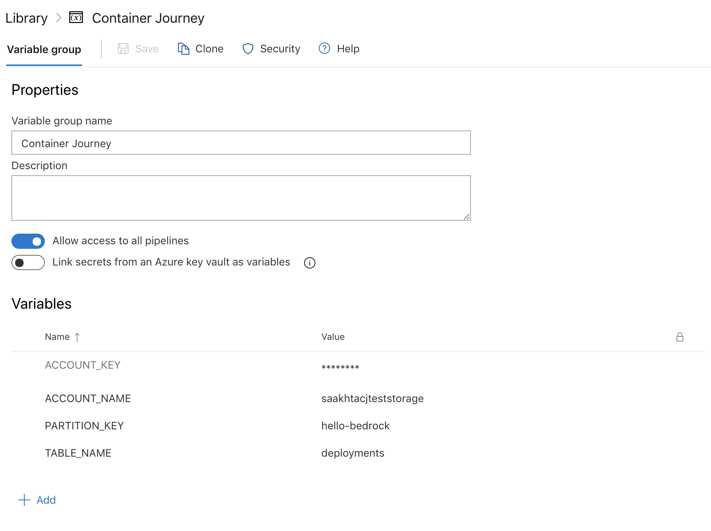

# Onboard a Bedrock project to use Service Introspection

Service Introspection shows information about a
[Bedrock GitOps workflow](https://github.com/microsoft/bedrock/tree/master/gitops).

Service introspection is used via the `spk deployment` commands. More
information about the commands is available in the command reference
[here](https://github.com/CatalystCode/spk/blob/master/docs/service-introspection.md).

To use service introspection you first need to make sure you have the following
pre-requisites.

## Pre-Requisites

1. GitOps pipelines workflow in Bedrock. To setup the workflow, follow
   [these](https://github.com/microsoft/bedrock/tree/master/gitops)
   instructions.
2. [Service introspection storage in Azure](#service-introspection-storage). See
   below for instructions on how to create one.
3. [Pipelies configuration](#pipelines-configuration)

### Service introspection storage

Service introspection tool needs a database to store the information about your
pipelines and services. Currently, service introspection supports storage in the
form of an Azure Storage table. Follow the steps below to create it.

1. Create an Azure storage account:

#### Option 1:

Use the
[`spk deployment onboard`](https://github.com/CatalystCode/spk/blob/master/docs/service-introspection.md#onboard)
command.

#### Option 2:

Create the account manually. You will need to have the following properties of
this storage before proceeding:

- Name of the storage account
- Access key to this storage account
- Table name (this is the table that will store Spektate introspection details)

Once you have a storage account with a table, you may proceed to start updating
the pipelines to send data to Spektate storage.

**Note:** The Azure storage account is needed to store information about your
pipelines and services that is displayed by service introspection.

2. Create a table. Follow these
   [instructions](https://docs.microsoft.com/en-us/azure/storage/tables/table-storage-quickstart-portal).

### Pipelines Configuration

The Bedrock GitOps pipelines need to be configured to start sending data to
`spk` service introspection. This is done by adding a script snippet in each
`azure-pipelines.yml` configuration.

#### Configure a variable group

To send data from Azure pipelines to the service introspection storage created
previously a variable group needs to be configured in Azure DevOps (where the
pipelines are).

To configure the variable group run: `spk variable-group create`

#### Pipeline 1: CI pipeline configuration

The CI pipeline runs from the source repository to build a docker image.

Paste the following task in its corresponding `azure-pipelines.yml`:

```yaml
- bash: |
    curl $SCRIPT > script.sh
    chmod +x ./script.sh
    tag_name="hello-spektate-$(Build.SourceBranchName)-$(Build.BuildId)"
    commitId=$(Build.SourceVersion)
    commitId=$(echo "${commitId:0:7}")
    ./script.sh $(ACCOUNT_NAME) $(ACCOUNT_KEY) $(TABLE_NAME) $(PARTITION_KEY) p1 $(Build.BuildId) imageTag $tag_name commitId $commitId service $(Build.Repository.Name)
  displayName: Update manifest pipeline details in CJ db
  env:
    SCRIPT: https://raw.githubusercontent.com/catalystcode/spk/master/scripts/update_introspection.sh
```

This task will update the service introspection storage table for every build
that runs from the source repository. This information will be available for use
by service introspection.

##### Note:

- Make sure the variable `tag_name` is set to the tag name for the image being
  built in your docker step.

- Add the task early on so that information is sent to spk.

- Add the task before the crucial steps in your pipeline. This will capture
  details about failures if the important steps fail.

#### Pipeline 2: CD release pipeline (ACR to HLD) configuration

The CD release pipeline updates the docker image number in the HLD.

Paste the following task in its corresponding `azure-pipelines.yml`:

```yaml
 latest_commit=$(git rev-parse --short HEAD)
 echo "latest_commit=$latest_commit"

 # Download update storage script
 curl https://raw.githubusercontent.com/catalystcode/spk/master/scripts/update_introspection.sh > script.sh
 chmod +x script.sh

 ./script.sh $(ACCOUNT_NAME) $(ACCOUNT_KEY) $(TABLE_NAME) $(PARTITION_KEY) imageTag $(Build.BuildId) p2 $(Release.ReleaseId) hldCommitId $latest_commit env $(Release.EnvironmentName)
```

This task is the same as the one from step 1 but instead passes the information
that corresponds to the CD release pipeline.

#### Pipeline 3: HLD manifest pipeline

The HLD manifest pipeline builds the HLD using `fabrikate` and generates
resource manifests that are then placed in the resource manifest repository.

Paste the following task in the `azure-pipelines.yml` file **before** the
`fabrikate` steps:

```yaml
- bash: |
    curl $SCRIPT > script.sh
    chmod +x ./script.sh
    commitId=$(Build.SourceVersion)
    commitId=$(echo "${commitId:0:7}")
    ./script.sh $(ACCOUNT_NAME) $(ACCOUNT_KEY) $(TABLE_NAME) $(PARTITION_KEY) hldCommitId $commitId p3 $(Build.BuildId)
  displayName: Update manifest pipeline details in CJ db
  env:
    SCRIPT: https://raw.githubusercontent.com/catalystcode/spk/master/scripts/update_introspection.sh
```

Paste the following task after the `fabrikate` step:

```yaml
- script: |
    cd "$HOME"/hello-bedrock-manifest
    curl $SCRIPT > script.sh
    chmod +x ./script.sh
    latest_commit=$(git rev-parse --short HEAD)
    ./script.sh $(ACCOUNT_NAME) $(ACCOUNT_KEY) $(TABLE_NAME) $(PARTITION_KEY) p3 $(Build.BuildId) manifestCommitId $latest_commit
  displayName: Update commit id in database
  env:
    SCRIPT: https://raw.githubusercontent.com/catalystcode/spk/master/scripts/update_introspection.sh
```

This task will update the `manifestCommitId`.

## Update the pipelines to send data to storage

1. Create a variable group with the following variables, which will be used by
   the tasks in each of the pipelines to access the storage.

   - `ACCOUNT_KEY`: Set this to the access key for your storage account
   - `ACCOUNT_NAME`: Set this to the name of your storage account
   - `PARTITION_KEY`: This field can be a distinguishing key that recognizea
     your source repository in the storage, for eg. in this example, we're using
     the name of the source repository `hello-bedrock`
   - `TABLE_NAME`: Set this to the name of the table in your storage account
     that you prefer to use

   

   Make sure that you update the pipelines in the following steps to include
   this variable group, such as below:

   ```yaml
   variables:
     - group: <your-variable-group-name>
   ```

## Getting started

After completing the steps in this guide, you should be able to:

- Fill out the `azure_devops` and `introspection` settings in
  [`spk-config.yaml`](https://github.com/CatalystCode/spk/blob/master/spk-config.yaml)
  so that you can use service introspection. More information about `spk` config
  can be found on the [main page](https://github.com/catalystcode/spk).

- Validate and verify the `spk-config.yaml` settings and the service
  introspection storage using
  [`spk deployment validate`](https://github.com/CatalystCode/spk/blob/master/docs/service-introspection.md#validate)

- Get information about your deployment using
  [`spk deployment get`](https://github.com/CatalystCode/spk/blob/master/docs/service-introspection.md#get)

- Launch the dashboard to visualize the data using
  [`spk deployment dashboard`](https://github.com/CatalystCode/spk/blob/master/docs/service-introspection.md#dashboard)
