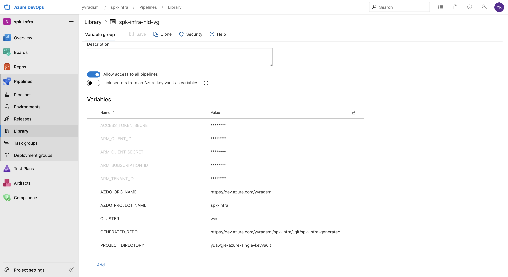
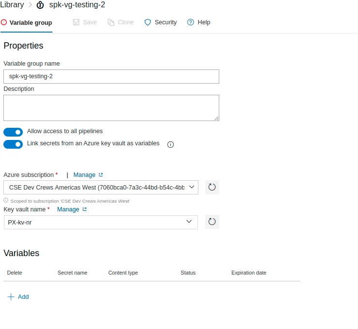
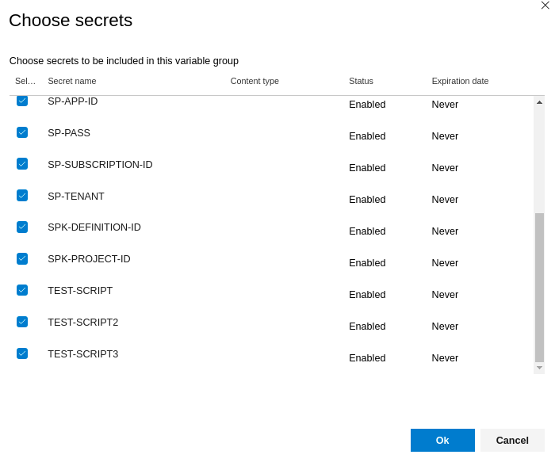
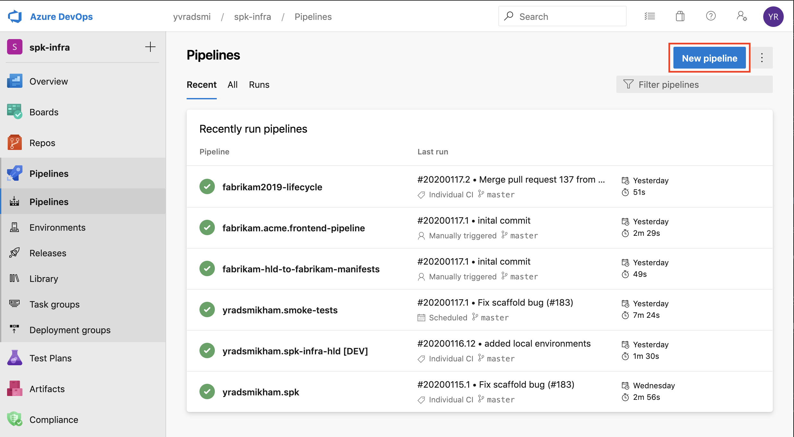
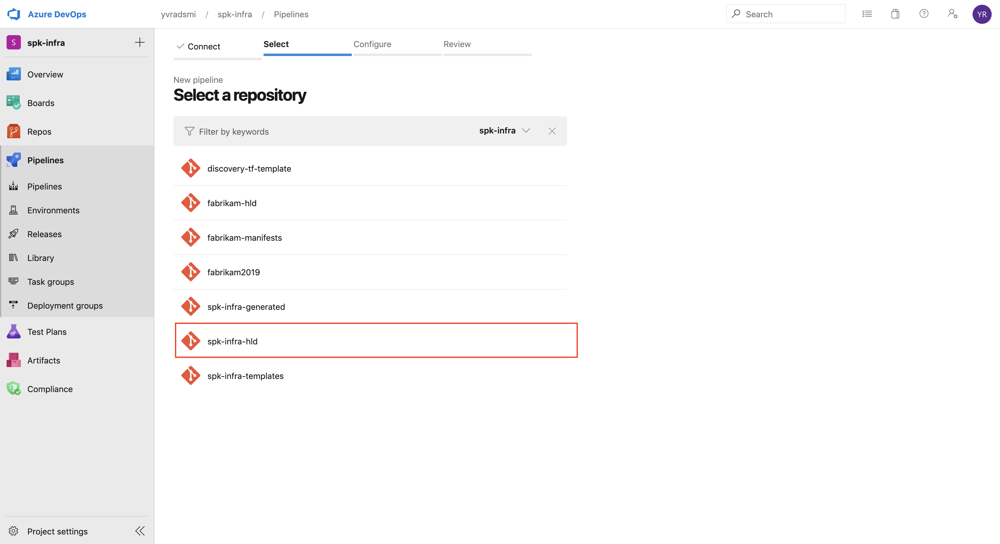
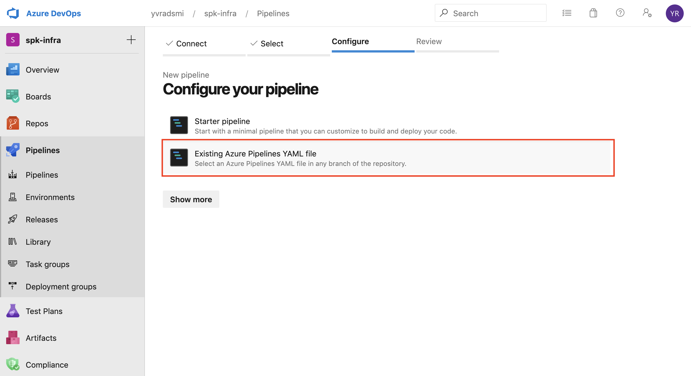
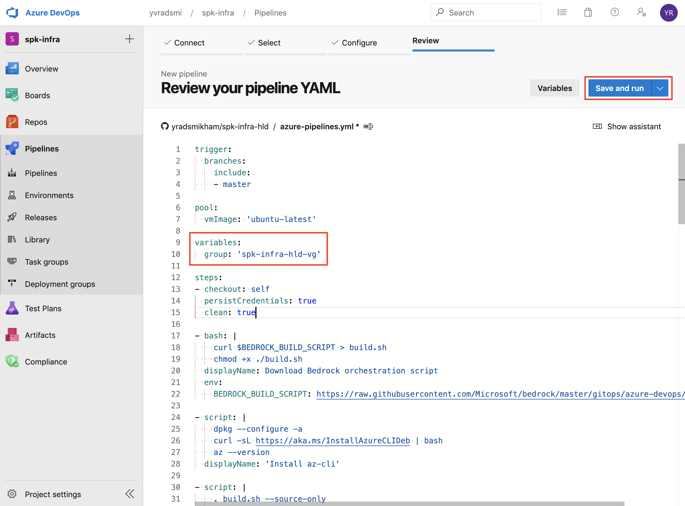
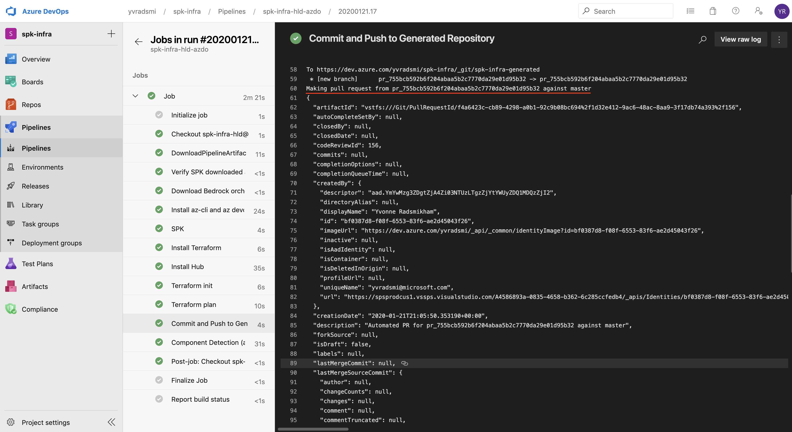
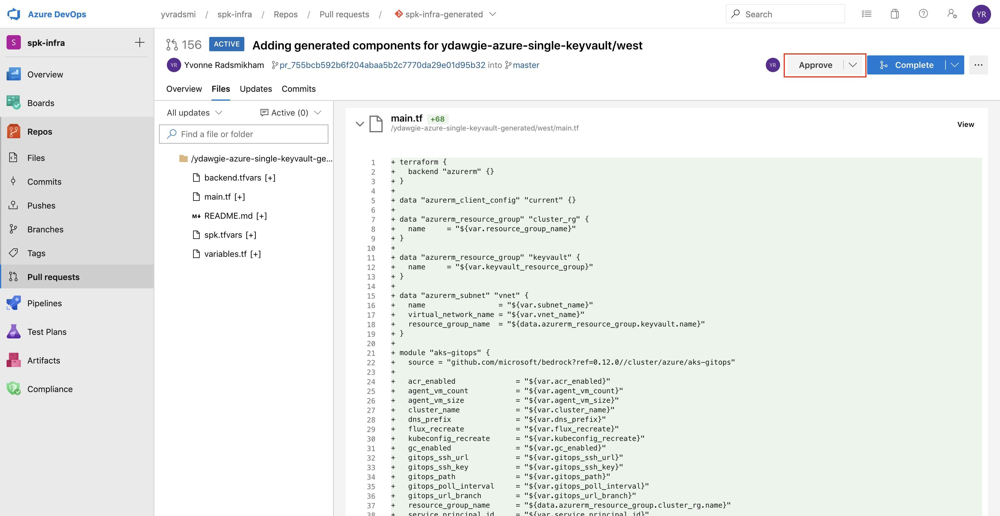
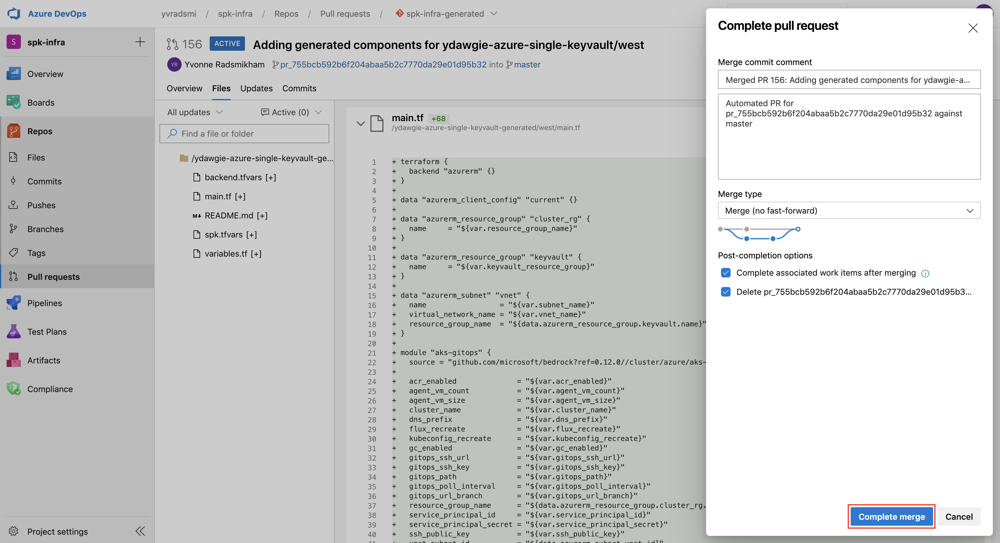

# Guide: Infrastructure Generation Pipeline

This section describes how to configure Azure Devops to be your CI/CD
orchestrator for your Infrastructure Generation workflow using `spk infra`.

## Prerequisites

1. _Permissions_: The ability to create Projects in your Azure DevOps
   Organization.
2. _High Level Definitions_: Your own infrastructure high level definitions for
   your deployment. You can refer to a sample repo
   [here](https://github.com/yradsmikham/spk-infra-hld). You should be able to
   create your Infra HLD repo using a scaffolding process via `spk` (i.e.
   `spk infra scaffold`). For more information on how to do that, please refer
   to the
   [Cloud Infra Management](https://github.com/CatalystCode/spk/blob/master/docs/cloud-infra-management.md#scaffold)
   doc.

## Setup

### 1. Create Repositories and Personal Access Tokens (PATs)

Create both an infrastructure high level definition (HLD) and infrastructure
generated repos. You will also need to create personal access tokens that you
can use for the Infra CI/CD pipeline. We have instructions for how to do that in
two flavors:

- [Azure DevOps](https://github.com/microsoft/bedrock/blob/master/gitops/azure-devops/ADORepos.md)
- [GitHub](https://github.com/microsoft/bedrock/blob/master/gitops/azure-devops/GitHubRepos.md)

### 2. Add Azure Pipeline Build YAML

The SPK repository has a
[template](../../azure-pipelines/templates/infra-generation-pipeline.yml) Azure
DevOps pipeline that you may use as reference. Add the
`infra-generation-pipeline.yml` file to the root of the Infra HLD repo.

### 3. Create Pipeline

We use
[Azure Pipelines](https://docs.microsoft.com/en-us/azure/devops/pipelines/get-started/key-pipelines-concepts?toc=/azure/devops/pipelines/toc.json&bc=/azure/devops/boards/pipelines/breadcrumb/toc.json&view=azure-devops)
to generate Terraform files based on your infrastructure high level description
yaml files (e.g. definition.yaml).

In Azure DevOps:

#### 3.1a. Create a Variable Group.

Variable Groups may vary based on the `azure-pipelines.yml` used, but for the
spk `infra-generation-pipeline.yml` template, the following variables will need
to be added as part of the pipeline Variable Group:

```
ACCESS_TOKEN_SECRET: Personal Access Token for your repo type.
ARM_CLIENT_ID: Azure Service Principal App ID
ARM_CLIENT_SECRET: Azure Service Principal password
ARM_SUBSCRIPTION_ID: Azure Subscription ID
ARM_TENANT_ID: Azure Service Principal Tenant ID
CLUSTER: A specific cluster name of a multi-cluster (i.e. west)
GENERATED_REPO: The full URL to your manifest repo (i.e. https://github.com/yradsmikham/spk-infra-generated.git)
PROJECT_DIRECTORY: The name of your project (i.e. discovery-service)
```

If using Azure DevOps repos, be sure to include the additional environment
variables:

```
AZDO_ORG_NAME: Azure DevOps organization url (i.e. https://dev.azure.com/org_name/)
AZDO_PROJECT_NAME: The name of the project in your Azure DevOps organization where the repository is hosted
```

You can use `spk` to create the Azure DevOps Variable Groups by executing
`spk variable-group create` described in this
[doc](../../guides/variable-group.md). This will require you to create a
variable group manifest similar to the following:

```yml
name: "spk-infra-hld-vg"
description: "variable group for infra hld"
type: "Vsts"
variables:
  ACCESS_TOKEN_SECRET:
    value: "<PAT>"
  ARM_CLIENT_ID:
    value: "<SP-APP-ID>"
  ARM_CLIENT_SECRET:
    value: "<SP-PASSWORD>"
  ARM_SUBSCRIPTION_ID:
    value: "<SUBSCRIPTION-ID>"
  ARM_TENANT_ID:
    value: "<SP-TENANT-ID>
  CLUSTER:
    value: "<CLUSTER-NAME>"
  GENERATED_REPO:
    value: "<GIT-URL-TO-GENERATED-REPO>"
  PROJECT_DIRECTORY:
    value: "<PROJECT-NAME>"
  AZDO_ORG_NAME: (optional)
    value: "<AZURE-DEVOPS-ORG-NAME>"
  AZDO_PROJECT_NAME: (optional)
    value: "<AZURE-DEVOPS-PROJECT-NAME>"
```



#### 3.1b. Create a Variable Group using Azure Key Vault

By using the `spk variable-group create` you are also able to link variables to
secrets in Azure Keyvault. Create a variable group in the portal or throught the
`az` cli.

> Please note that Key Vault Secret names can only contain alphanumeric
> characters and dashes.

Once the Keyvault has been created, You can now create a variable group manifest
similar to the following:

```yml
name: "spk-infra-hld-vg-kv"
description: "key vault variable group for infra hld"
type: "AzureKeyVault"
variables:
  ACCESS-TOKEN-SECRET:
    enabled: true
  ARM-CLIENT-ID:
    enabled: true
  ARM-CLIENT-SECRET:
    enabled: true
  ARM-SUBSCRIPTION-ID:
    enabled: true
  ARM-TENANT-ID:
    enabled: true
  CLUSTER:
    enabled: true
  GENERATED-REPO:
    enabled: true
  PROJECT-DIRECTORY:
    enabled: true
  AZDO-ORG-NAME: (optional)
    enabled: true
  AZDO-PROJECT-NAME: (optional)
    enabled: true
key_vault_provider:
  name: "myvault"                                                # name of the Azure Key Vaukt with Secrets
  service_endpoint:                                                   # service endpoint is required to authorize with Azure Key Vault
    name: "my-KeyVault"
    # If the service endpoint with this name does not exist, the following values are required to create a new service connection with this name
    subscription_id: "<SUBSCRIPTION-ID>"
    # Azure Subscription id where Key Vault exist
    subscription_name: "<SUBSCRIPTION-NAME>"
    # Azure Subscription name where Key Vault exist
    service_principal_id: "<SP-ID>"
    # Service Principal Id that has 'Get' and 'List' in Key Vault Access Policy
    service_principal_secret: "<SP-PASSWORD>"
    # Service Principal secret for the above Service Principal Id
    tenant_id: "<SP-TENANT-ID>"
    # AAD Tenant Id for the above Service Principal
```

Alternatively you can create a variable group through the Azure DevOps UI and
connect it to the pre-existing Key Vault you created. Navigate to your pipeline
library and create a new variable group. Identify the key vault that was
previously provisioned.



Additionally, be sure to select the respective Key secrets you wish to map to
your variable group.



#### 3.2. Create a new pipeline.

You can use the Azure CLI to create the Generation pipeline. To do that, you
will need to do the following:

- Create a service endpoint for the git repository (if you do not already have
  one). This is **only required** for Github repos:

`az devops service-endpoint github create --github-url <github-url> --name <name> --org <azure-devops-org-name> --project <azure-devops-project-name>`

- Then, create the Azure DevOps pipeline for Infra Generation:

`az pipelines create --name <pipeline-name> --branch <repo-branch> --org <org-url> --project <project-name> --repository <git-repo-url> --yaml-path ./azure-pipellines.yml --service-connection <service-connection-id>`

**Note**: The `--service-connection` argument is only required for GitHub repos.
It can be omitted when using Azure DevOps repos.

Additionally, you can also use the Azure DevOps portal to manually create the
pipeline as shown in the following steps 3-7:



3. Choose the platform you are using for source control. For now, there are only
   examples for GitHub and Azure DevOps repos. However, other version control
   tools should be fairly similar.


4. Select an Infra HLD repository.



5. Choose "Existing Azure Pipeline YAML file" if there is an
   `azure-pipelines.yml` in the selected Infra HLD repo.



6. On the side panel, select the appropriate repo branch to work from, and also
   the path to the `azure-pipelines.yml` file.


7. Be sure to verify that the `azure-pipelines.yml` is linked to the correct
   variable group that was created earlier. When the pipeline is ready, hit
   'Save and run'



8. Create Pull Request

Assuming your pipeline runs to success...



There should now be a PR pending approval for your Infra Generated Repo.


9. Approve and merge PR

If the PR looks correct, hit 'Approve' and then 'Complete'.


From here, you can complete the merge to master branch of the Infra Generated
Repo.


